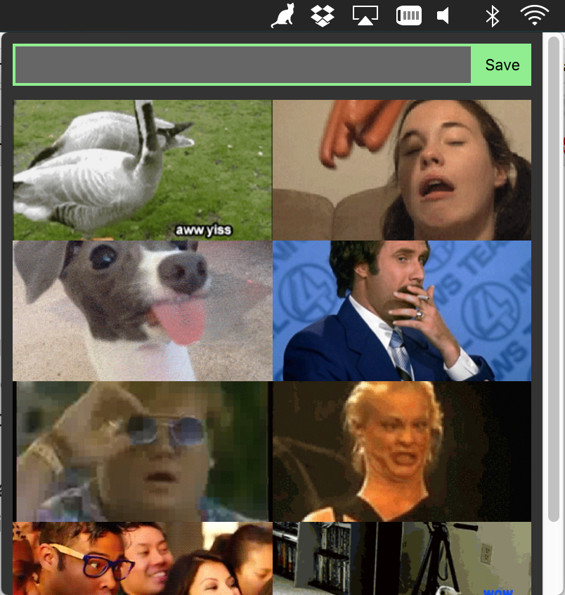

# magif

save gifs in your menu bar, click to copy



###usage
- paste links to gifs and click save
- then you can click to copy to your clipboard
- any space separated words after the gif link will be considered tags
- e.g. `https://media.giphy.com/media/oKn2qp8kKfguk/giphy.gif geese breadcrumbs`<br>
will add the gif with the tags `geese` and `breadcrumbs`

###installation
```
git clone git@github.com:guyfedwards/magif.git
cd magif
npm install
```

###run dev
```
npm start
```

###package electron app
```
npm run build
cp -R magif-darwin-x64/magif.app /Applications
```


